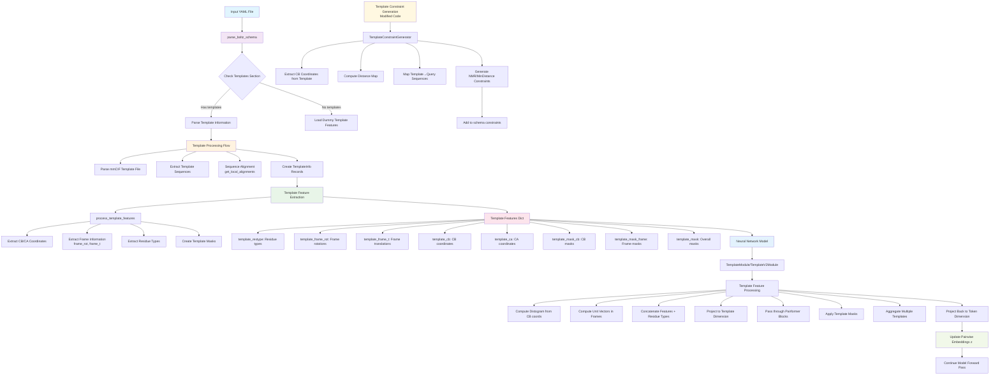

# Boltz-2 Template 정보 처리 흐름도

## Template Processing Flow Chart

## 흐름도 설명

### 입력 단계
- **Input YAML File**: 사용자가 제공하는 구조 예측 설정 파일
- **parse_boltz_schema**: YAML 파일을 파싱하여 내부 데이터 구조로 변환

### Template 정보 처리
- **Template Section Check**: YAML에 templates 섹션이 있는지 확인
- **Template Processing**: mmCIF 파일 파싱, 서열 정렬, TemplateInfo 객체 생성
- **Template Constraint Generation**: 새로운 기능으로 template 구조로부터 거리 제약조건 자동 생성

### Feature 추출
- **Template Feature Extraction**: Template 구조로부터 신경망 입력용 feature 추출
- **Feature Dict Creation**: 8가지 주요 template feature 생성

### 모델 적용
- **Neural Network Integration**: TemplateModule에서 feature 처리
- **Pairwise Embedding Update**: Template 정보를 pairwise embedding z에 통합
- **Structure Prediction**: 업데이트된 embedding으로 구조 예측 수행 