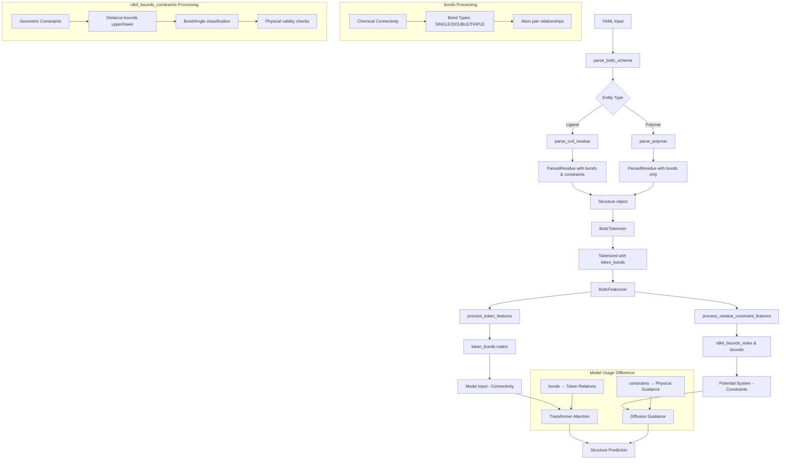

# ParsedResidue: bonds vs rdkit_bounds_constraints 분석

## 개요

이 문서는 Boltz 코드베이스에서 `ParsedResidue` 클래스의 두 가지 핵심 데이터 구조인 `bonds`와 `rdkit_bounds_constraints`의 차이점과 활용 방식을 분석합니다.

## 1. 구조적 차이점 비교

| 특성 | **`bonds` (ParsedBond)** | **`rdkit_bounds_constraints` (ParsedRDKitBoundsConstraint)** |
|------|---------------------------|---------------------------------------------------------------|
| **데이터 타입** | `list[ParsedBond]` | `Optional[list[ParsedRDKitBoundsConstraint]]` |
| **필드 구성** | `atom_1: int`, `atom_2: int`, `type: int` | `atom_idxs: tuple[int, int]`, `is_bond: bool`, `is_angle: bool`, `upper_bound: float`, `lower_bound: float` |
| **목적** | **화학적 연결성 (Connectivity)** | **기하학적 제약조건 (Geometric Constraints)** |
| **정보 내용** | 원자 간 결합 존재 여부 및 결합 타입 | 원자 간 거리/각도의 허용 범위 |
| **생성 조건** | Ligand: 항상 생성, Polymer: 새로 추가된 기능 | Template 사용 시 또는 특별한 조건에서만 생성 |
| **사용 목적** | 모델의 구조적 이해 및 tokenization | Diffusion 과정에서 물리적 제약 적용 |

### 1.1 ParsedBond 구조
```python
@dataclass(frozen=True)
class ParsedBond:
    """A parsed bond object."""
    atom_1: int      # 첫 번째 원자 인덱스
    atom_2: int      # 두 번째 원자 인덱스  
    type: int        # 결합 타입 (SINGLE, DOUBLE, TRIPLE, AROMATIC)
```

### 1.2 ParsedRDKitBoundsConstraint 구조
```python
@dataclass(frozen=True)
class ParsedRDKitBoundsConstraint:
    """A parsed RDKit bounds constraint object."""
    atom_idxs: tuple[int, int]  # 원자 쌍 인덱스
    is_bond: bool              # 화학결합 여부
    is_angle: bool             # 각도 제약 여부
    upper_bound: float         # 상한 거리/각도
    lower_bound: float         # 하한 거리/각도
```

## 2. 데이터 생성 및 처리 과정

### 2.1 bonds 생성 과정

#### Ligand에서의 bonds 생성
```python
# parse_ccd_residue 함수에서
bonds = []
unk_bond = const.bond_type_ids[const.unk_bond_type]
for bond in ref_mol.GetBonds():
    idx_1 = bond.GetBeginAtomIdx()
    idx_2 = bond.GetEndAtomIdx()
    
    # Skip bonds with atoms ignored
    if (idx_1 not in idx_map) or (idx_2 not in idx_map):
        continue
        
    idx_1 = idx_map[idx_1]
    idx_2 = idx_map[idx_2]
    start = min(idx_1, idx_2)
    end = max(idx_1, idx_2)
    bond_type = bond.GetBondType().name
    bond_type = const.bond_type_ids.get(bond_type, unk_bond)
    bonds.append(ParsedBond(start, end, bond_type))
```

#### Polymer에서의 bonds 생성 (새로 추가된 기능)
```python
# parse_polymer 함수에서 - 최근 추가된 intra-residue bonds
bonds = []
if ref_mol.GetNumAtoms() > 1:
    unk_bond = const.bond_type_ids[const.unk_bond_type]
    ref_atom_indices = set(ref_name_to_atom[a].GetIdx() for a in const.ref_atoms[res_corrected])
    
    for bond in ref_mol.GetBonds():
        idx_1 = bond.GetBeginAtomIdx()
        idx_2 = bond.GetEndAtomIdx()
        
        # Only include bonds where both atoms are in the reference atom set
        if idx_1 in ref_atom_indices and idx_2 in ref_atom_indices:
            if idx_1 in idx_map and idx_2 in idx_map:
                mapped_idx_1 = idx_map[idx_1]
                mapped_idx_2 = idx_map[idx_2]
                start = min(mapped_idx_1, mapped_idx_2)
                end = max(mapped_idx_1, mapped_idx_2)
                bond_type = bond.GetBondType().name
                bond_type = const.bond_type_ids.get(bond_type, unk_bond)
                bonds.append(ParsedBond(start, end, bond_type))
```

### 2.2 rdkit_bounds_constraints 생성 과정

```python
def compute_geometry_constraints(mol: Mol, idx_map):
    if mol.GetNumAtoms() <= 1:
        return []

    # RDKit의 GetMoleculeBoundsMatrix로 기하학적 제약 계산
    bounds = GetMoleculeBoundsMatrix(
        mol,
        set15bounds=True,
        scaleVDW=True,
        doTriangleSmoothing=True,
        useMacrocycle14config=False,
    )
    
    # Bond와 angle 패턴 식별
    bonds = set(tuple(sorted(b)) for b in mol.GetSubstructMatches(Chem.MolFromSmarts("*~*")))
    angles = set(tuple(sorted([a[0], a[2]])) for a in mol.GetSubstructMatches(Chem.MolFromSmarts("*~*~*")))
        
    constraints = []
    for i, j in zip(*np.triu_indices(mol.GetNumAtoms(), k=1)):
        if i in idx_map and j in idx_map:
            constraint = ParsedRDKitBoundsConstraint(
                atom_idxs=(idx_map[i], idx_map[j]),
                is_bond=tuple(sorted([i, j])) in bonds,
                is_angle=tuple(sorted([i, j])) in angles,
                upper_bound=bounds[i, j],
                lower_bound=bounds[j, i],
            )
            constraints.append(constraint)
    return constraints
```

## 3. 모델에서의 활용 방식

### 3.1 bonds 활용 경로

#### Tokenization 단계
```python
# BoltzTokenizer.tokenize()에서
token_bonds = []

# Add atom-atom bonds from ligands
for bond in struct.bonds:
    if (bond["atom_1"] not in atom_to_token or bond["atom_2"] not in atom_to_token):
        continue
    token_bond = (atom_to_token[bond["atom_1"]], atom_to_token[bond["atom_2"]])
    token_bonds.append(token_bond)
```

#### Feature Processing 단계
```python
# process_token_features()에서
tok_to_idx = {tok["token_idx"]: idx for idx, tok in enumerate(token_data)}
bonds = torch.zeros(num_tokens, num_tokens, dtype=torch.float)
for token_bond in token_bonds:
    token_1 = tok_to_idx[token_bond["token_1"]]
    token_2 = tok_to_idx[token_bond["token_2"]]
    bonds[token_1, token_2] = 1
    bonds[token_2, token_1] = 1

bonds = bonds.unsqueeze(-1)
```

#### 모델 입력
- `token_bonds` 매트릭스로 변환되어 transformer의 attention mechanism에 활용
- 토큰 간 연결성 정보를 모델에 제공

### 3.2 rdkit_bounds_constraints 활용 경로

#### Feature Processing 단계
```python
# process_residue_constraint_features()에서
rdkit_bounds_index = torch.tensor(rdkit_bounds_constraints["atom_idxs"].copy(), dtype=torch.long).T
rdkit_bounds_bond_mask = torch.tensor(rdkit_bounds_constraints["is_bond"].copy(), dtype=torch.bool)
rdkit_bounds_angle_mask = torch.tensor(rdkit_bounds_constraints["is_angle"].copy(), dtype=torch.bool)
rdkit_upper_bounds = torch.tensor(rdkit_bounds_constraints["upper_bound"].copy(), dtype=torch.float)
rdkit_lower_bounds = torch.tensor(rdkit_bounds_constraints["lower_bound"].copy(), dtype=torch.float)
```

#### Potential System에서의 활용
```python
# PoseBustersPotential에서
class PoseBustersPotential(FlatBottomPotential, DistancePotential):
    def compute_args(self, feats, parameters):
        pair_index = feats['rdkit_bounds_index'][0]
        lower_bounds = feats['rdkit_lower_bounds'][0].clone()
        upper_bounds = feats['rdkit_upper_bounds'][0].clone()
        bond_mask = feats['rdkit_bounds_bond_mask'][0]
        angle_mask = feats['rdkit_bounds_angle_mask'][0]
        
        # 타입별 버퍼 적용
        lower_bounds[bond_mask * ~angle_mask] *= (1.0 - parameters['bond_buffer'])
        upper_bounds[bond_mask * ~angle_mask] *= (1.0 + parameters['bond_buffer'])
        lower_bounds[~bond_mask * angle_mask] *= (1.0 - parameters['angle_buffer'])
        upper_bounds[~bond_mask * angle_mask] *= (1.0 + parameters['angle_buffer'])
        
        k = torch.ones_like(lower_bounds)
        return pair_index, (k, lower_bounds, upper_bounds), None
```

## 4. 데이터 플로우 다이어그램



## 5. 핵심 차이점 요약

### 5.1 개념적 차이
- **bonds**: "어떤 원자들이 연결되어 있는가?" (연결성/토폴로지)
- **rdkit_bounds_constraints**: "연결된 원자들이 얼마나 떨어져 있어야 하는가?" (기하학/물리학)

### 5.2 기능적 차이
1. **bonds**
   - 화학적 연결성을 나타내는 **토폴로지 정보**
   - 모델이 분자의 구조적 관계를 이해하는 데 사용
   - 토큰 간 attention에 영향을 줄 수 있는 기본 정보
   - 항상 생성됨 (ligand 및 polymer)

2. **rdkit_bounds_constraints**
   - 물리적으로 타당한 구조를 보장하는 **제약 조건**
   - Diffusion 과정에서 비물리적 구조 방지
   - 원자 간 거리의 허용 범위를 명시적으로 제한
   - 특정 조건에서만 생성됨 (template 사용 시 등)

### 5.3 상호 보완적 역할
이 두 정보는 서로 다른 목적으로 사용되며, 함께 사용될 때 더욱 정확하고 물리적으로 타당한 구조 예측이 가능합니다:

- **bonds**: 모델의 구조 이해도 향상
- **rdkit_bounds_constraints**: 생성된 구조의 물리적 타당성 보장

## 6. 실제 사용 예시

### 6.1 Ligand 처리
```python
# Ligand의 경우 두 정보 모두 생성
residue = ParsedResidue(
    name="LIG",
    atoms=atoms,
    bonds=bonds,  # 화학 결합 정보
    rdkit_bounds_constraints=rdkit_bounds_constraints,  # 거리 제약
    # ... other fields
)
```

### 6.2 Polymer 처리 (Template 있는 경우)
```python
# Template이 있는 polymer의 경우
residue = ParsedResidue(
    name="ALA",
    atoms=atoms,
    bonds=bonds,  # 새로 추가된 intra-residue bonds
    rdkit_bounds_constraints=rdkit_bounds_constraints,  # Template 기반 제약
    # ... other fields
)
```

### 6.3 일반 Polymer 처리
```python
# 일반 polymer의 경우
residue = ParsedResidue(
    name="ALA",
    atoms=atoms,
    bonds=bonds,  # 새로 추가된 intra-residue bonds
    rdkit_bounds_constraints=None,  # 제약 없음
    # ... other fields
)
```

## 결론

`bonds`와 `rdkit_bounds_constraints`는 Boltz 모델에서 서로 다른 역할을 담당하는 보완적인 정보입니다. bonds는 화학적 연결성을 통해 모델의 구조 이해를 돕고, rdkit_bounds_constraints는 물리적 제약을 통해 생성된 구조의 타당성을 보장합니다. 두 정보를 함께 활용함으로써 더욱 정확하고 현실적인 분자 구조 예측이 가능해집니다. 