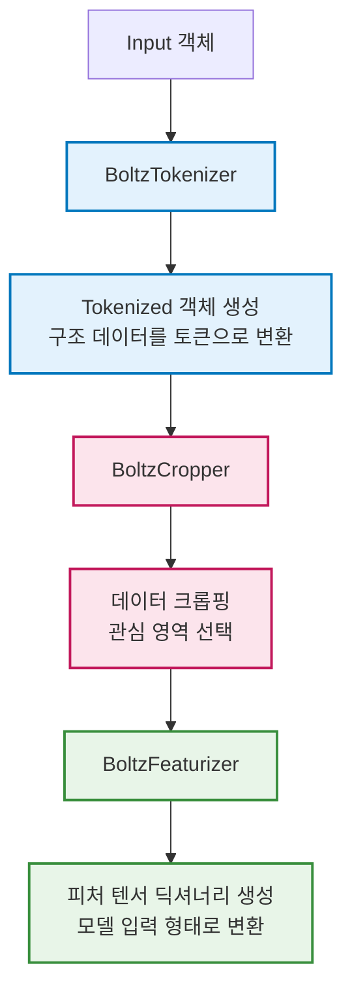
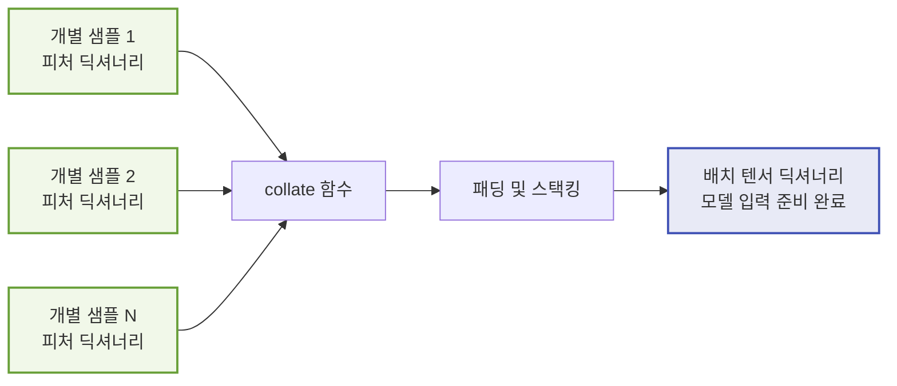

# Boltz 입력 데이터 로딩 및 준비 과정

이 문서는 `boltz` 프로젝트에서 입력 데이터가 어떻게 로드되고 준비되는지를 상세히 설명하고, 코드 작동 흐름을 Mermaid 플로우차트로 시각화합니다.

## 개요

`boltz`에서 구조 예측이나 훈련을 수행할 때, 원시 데이터 파일들(.npz 형식의 Structure, MSA, Constraints 파일)은 DataModule을 통해 모델이 처리할 수 있는 배치 텐서 형태로 변환됩니다. 이 과정은 여러 단계를 거쳐 이루어지며, 각 단계는 특정한 역할을 담당합니다.

## Manifest.json 생성 과정

### 위치: `src/boltz/main.py`의 `process_inputs` 함수

`Manifest.json` 파일은 `boltz predict` 명령어 실행 시 자동으로 생성됩니다. 이 파일은 처리할 모든 데이터 항목들의 메타데이터를 포함하는 인덱스 역할을 합니다.

```mermaid
flowchart TD
    A[boltz predict 명령어 실행] --> B[check_inputs 함수<br/>입력 파일 유효성 검사]
    B --> C[process_inputs 함수 호출]
    C --> D{기존 manifest.json<br/>존재 여부 확인}
    
    D -->|존재| E[기존 Manifest 로드<br/>Manifest.load]
    D -->|미존재| F[새 records 리스트 초기화]
    
    E --> G[기존 Record들과 비교<br/>누락된 파일 확인]
    G --> H{처리할 파일<br/>있는가?}
    H -->|없음| I[기존 Manifest 업데이트 후 저장]
    H -->|있음| J[누락된 파일들만 처리]
    
    F --> K[각 입력 파일 순회<br/>for path in data]
    J --> K
    
    K --> L{파일 형식 확인}
    L -->|.fasta/.fa/.fas| M[parse_fasta 호출]
    L -->|.yaml/.yml| N[parse_yaml 호출]
    L -->|기타| O[에러 발생]
    
    M --> P[Target 객체 생성<br/>record, structure, constraints 포함]
    N --> P
    
    P --> Q[MSA 생성 필요 여부 확인<br/>단백질 체인의 msa_id == 0]
    Q -->|필요| R[compute_msa 함수 호출<br/>MMSeqs2 서버 사용]
    Q -->|불필요| S[MSA 파일 처리]
    
    R --> S
    S --> T[MSA 데이터 파싱 및 저장<br/>.a3m 또는 .csv 형식]
    T --> U[Record 객체에 MSA 경로 업데이트]
    U --> V[Structure 데이터 저장<br/>.npz 형식]
    V --> W[Constraints 데이터 저장<br/>.npz 형식]
    W --> X[records 리스트에 추가]
    
    X --> Y{모든 파일<br/>처리 완료?}
    Y -->|아니오| K
    Y -->|예| Z[Manifest 객체 생성<br/>Manifest&#40;records&#41;]
    
    Z --> AA[manifest.json 파일 저장<br/>manifest.dump&#40;&#41;]
    
    I --> BB[process_inputs 함수 종료]
    AA --> BB

    %% 서브그래프로 그룹화
    subgraph "입력 검증 및 초기화"
        A
        B
        C
        D
        E
        F
        G
        H
        I
        J
    end
    
    subgraph "개별 파일 처리 루프"
        K
        L
        M
        N
        O
        P
        Q
        R
        S
        T
        U
        V
        W
        X
        Y
    end
    
    subgraph "Manifest 생성 및 저장"
        Z
        AA
        BB
    end

    %% 스타일링
    classDef input fill:#e3f2fd,stroke:#0277bd,stroke-width:2px
    classDef process fill:#f3e5f5,stroke:#4a148c,stroke-width:2px
    classDef output fill:#e8f5e8,stroke:#1b5e20,stroke-width:2px
    classDef error fill:#ffebee,stroke:#c62828,stroke-width:2px
    
    class A,B input
    class C,E,F,G,J,K,M,N,P,Q,R,S,T,U,V,W,X,Z process
    class I,AA,BB output
    class O error
```



### process_inputs 함수의 주요 로직

#### 1. 기존 Manifest 처리
```python
# 라인 331-348: 기존 manifest.json 확인 및 로드
manifest_path = out_dir / "processed" / "manifest.json"
if manifest_path.exists():
    manifest: Manifest = Manifest.load(manifest_path)
    # 기존 Record들과 입력 파일 비교
    existing_records = [record for record in manifest.records if record.id in input_ids]
```

#### 2. 개별 파일 처리 루프
```python
# 라인 376-480: 각 입력 파일에 대한 처리
for path in tqdm(data):
    # 파일 형식에 따른 파싱
    if path.suffix in (".fa", ".fas", ".fasta"):
        target = parse_fasta(path, ccd)
    elif path.suffix in (".yml", ".yaml"):
        target = parse_yaml(path, ccd)
    
    # MSA 생성 및 처리
    # Structure 및 Constraints 데이터 저장
    # Record 리스트에 추가
```

#### 3. 최종 Manifest 생성
```python
# 라인 482-483: Manifest 객체 생성 및 저장
manifest = Manifest(records)
manifest.dump(out_dir / "processed" / "manifest.json")
```

### Record 객체 구조

각 Record는 다음과 같은 정보를 포함합니다:

```python
@dataclass(frozen=True)
class Record(JSONSerializable):
    id: str                              # 고유 식별자
    structure: StructureInfo             # 구조 메타데이터
    chains: list[ChainInfo]              # 체인 정보 리스트
    interfaces: list[InterfaceInfo]      # 인터페이스 정보 리스트
    inference_options: Optional[InferenceOptions] = None  # 추론 옵션
```

#### ChainInfo 상세 구조
```python
@dataclass(frozen=True)
class ChainInfo:
    chain_id: int           # 체인 ID
    chain_name: str         # 체인 이름
    mol_type: int          # 분자 타입 (단백질/DNA/RNA/리간드)
    cluster_id: Union[str, int]  # 클러스터 ID
    msa_id: Union[str, int]      # MSA 파일 경로 또는 ID
    num_residues: int       # 잔기 수
    valid: bool = True      # 유효성 플래그
    entity_id: Optional[Union[str, int]] = None  # 엔티티 ID
```

## 전체 데이터 로딩 플로우

```mermaid
flowchart TD
    A[원시 입력 데이터 파일<br/>Structure.npz, MSA.npz, Constraints.npz] --> B[DataModule 초기화]
    B --> C[Manifest.json 로드<br/>Manifest.load 호출]
    C --> D[Dataset 생성<br/>PredictionDataset/TrainingDataset]
    D --> E[DataLoader 생성]
    E --> F{배치 요청<br/>훈련/예측 루프에서}
    
    F --> G[Dataset.__getitem__&#40;idx&#41; 호출<br/>배치 크기만큼 반복]
    G --> H[load_input 함수 호출<br/>record 정보 전달]
    
    H --> I[Structure 데이터 읽기<br/>.npz 파일에서]
    H --> J[MSA 데이터 읽기<br/>.npz 파일에서 &#40;선택사항&#41;]
    H --> K[Constraints 데이터 읽기<br/>.npz 파일에서 &#40;선택사항&#41;]
    
    I --> L[Input 객체 생성]
    J --> L
    K --> L
    
    L --> M[토큰화 처리<br/>BoltzTokenizer]
    M --> N[크롭핑 처리<br/>BoltzCropper]
    N --> O[피처화 처리<br/>BoltzFeaturizer]
    
    O --> P[개별 샘플 반환<br/>피처 딕셔너리]
    P --> Q[샘플들을 배치로 수집]
    Q --> R[collate 함수 호출<br/>배치 텐서 생성]
    
    R --> S[최종 배치 텐서 딕셔너리<br/>모델 입력 준비 완료]

    %% 서브그래프로 그룹화
    subgraph "DataModule & Dataset 초기화"
        B
        C
        D
        E
    end
    
    subgraph "개별 샘플 처리 &#40;__getitem__&#41;"
        G
        H
        I
        J
        K
        L
        M
        N
        O
        P
    end
    
    subgraph "배치 처리"
        Q
        R
        S
    end

    %% 스타일링
    classDef file fill:#e1f5fe,stroke:#01579b,stroke-width:2px
    classDef process fill:#f3e5f5,stroke:#4a148c,stroke-width:2px
    classDef output fill:#e8f5e8,stroke:#1b5e20,stroke-width:2px
    
    class A,I,J,K file
    class B,C,D,E,G,H,M,N,O,R process
    class S output
```



## 상세 단계별 설명

### 1. 초기화 단계

#### DataModule 초기화
- `boltz` 실행 시 설정에 따라 `BoltzInferenceDataModule` 또는 `BoltzTrainingDataModule` 생성
- 데이터 파이프라인을 관리하는 중앙 컨트롤러 역할

#### Manifest 로드
- `manifest.json` 파일을 읽어 `Manifest` 객체로 변환
- 처리할 데이터 항목들(`Record`)의 메타데이터 포함
- 각 Record는 ID, 체인 정보, 파일 경로 등을 포함

#### Dataset 생성
- Manifest와 설정 정보를 바탕으로 Dataset 객체 생성
- 실제 데이터 로딩 로직을 포함하는 `__getitem__` 메소드 구현

### 2. 런타임 데이터 로딩

```mermaid
flowchart LR
    A[DataLoader 배치 요청] --> B[Dataset.__getitem__&#40;idx&#41;]
    B --> C[Record 정보 조회]
    C --> D[load_input 함수 호출]
    
    subgraph "load_input 내부 처리"
        D --> E[target_dir에서 Structure.npz 읽기]
        D --> F[msa_dir에서 MSA.npz 읽기]
        D --> G[constraints_dir에서 Constraints.npz 읽기<br/>&#40;선택사항&#41;]
        E --> H[Input 객체 생성]
        F --> H
        G --> H
    end
    
    H --> I[전처리 파이프라인]
    
    classDef internal fill:#fff3e0,stroke:#e65100,stroke-width:2px
    class E,F,G,H internal
```



#### load_input 함수 세부 동작
1. **Structure 데이터 로드**: 원자, 결합, 잔기, 체인 정보가 포함된 `.npz` 파일 읽기
2. **MSA 데이터 로드**: Multiple Sequence Alignment 정보 읽기 (해당하는 경우)
3. **Constraints 데이터 로드**: 잔기별 제약 조건 정보 읽기 (설정된 경우)
4. **Input 객체 생성**: 로드된 모든 데이터를 하나의 `Input` 객체로 결합

### 3. 전처리 파이프라인



### 4. 배치 생성



#### collate 함수의 역할
- 서로 다른 크기의 텐서들을 동일한 크기로 맞춤 (패딩)
- 개별 샘플들을 배치 차원으로 스택킹
- 모델이 효율적으로 처리할 수 있는 형태로 데이터 구성

## 핵심 코드 컴포넌트

### 주요 클래스 및 함수
- **BoltzInferenceDataModule/BoltzTrainingDataModule**: 데이터 파이프라인 관리
- **PredictionDataset/TrainingDataset**: 개별 데이터 로딩 및 전처리
- **load_input()**: 원시 파일에서 Input 객체 생성
- **collate()**: 배치 텐서 생성
- **BoltzTokenizer**: 구조 데이터 토큰화
- **BoltzCropper**: 데이터 크롭핑
- **BoltzFeaturizer**: 피처 생성

### 데이터 타입 흐름
```
Raw Files (.npz) → Structure/MSA/Constraints → Input → Tokenized → Features → Batch Tensors
```

## 성능 고려사항

1. **지연 로딩**: 데이터는 실제 필요할 때만 메모리에 로드됩니다
2. **병렬 처리**: DataLoader의 `num_workers` 설정을 통한 멀티프로세싱
3. **배치 처리**: 효율적인 GPU 활용을 위한 배치 단위 처리
4. **메모리 관리**: 큰 데이터셋의 경우 적절한 배치 크기 설정 필요

이 문서는 `boltz`의 데이터 로딩 파이프라인을 이해하는 데 도움이 되며, 새로운 데이터 타입 추가나 성능 최적화 시 참고자료로 활용할 수 있습니다. 