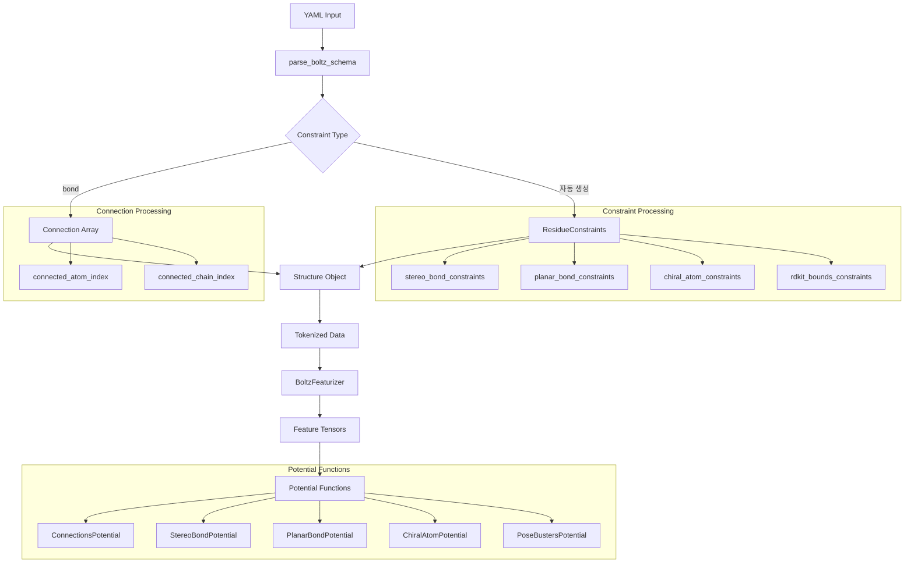

# Bond Constraint 전체 분석 - 정의부터 사용까지

이 문서는 Boltz 프로젝트에서 bond constraint가 어떻게 정의되고, 파싱되고, 저장되고, 최종적으로 모델에서 사용되는지 전체 흐름을 분석합니다.

## 1. Bond Constraint 정의 및 분류

### 1.1 Constraint 유형

Bond constraint는 Boltz에서 두 가지 서로 다른 개념으로 사용됩니다:

1. **User-defined Bond Constraint** (사용자 정의)
   - YAML 파일의 `constraints` 섹션에서 `bond` 키워드로 정의
   - 두 원자 간의 공유결합을 명시적으로 지정
   - `Connection` 데이터 타입으로 저장

2. **Automatic Bond Constraints** (자동 생성)
   - 분자의 geometry와 화학적 성질을 유지하기 위한 constraint들
   - RDKit에서 자동으로 계산되어 생성
   - 여러 종류: Stereo bond, Planar bond, Chiral atom 등

## 2. 데이터 플로우 분석



## 3. 코드 분석

### 3.1 YAML 파싱 단계 (schema.py)

#### User-defined Bond Constraint 파싱
```python
# 파일: src/boltz/data/parse/schema.py, 라인 1201-1210
if "bond" in constraint:
    if "atom1" not in constraint["bond"] or "atom2" not in constraint["bond"]:
        msg = "Bond constraint was not properly specified"
        raise ValueError(msg)

    c1, r1, a1 = tuple(constraint["bond"]["atom1"])
    c2, r2, a2 = tuple(constraint["bond"]["atom2"])
    c1, r1, a1 = atom_idx_map[(c1, r1 - 1, a1)]  # 1-indexed
    c2, r2, a2 = atom_idx_map[(c2, r2 - 1, a2)]  # 1-indexed
    connections.append((c1, c2, r1, r2, a1, a2))
```

**핵심 포인트:**
- YAML에서 `atom1`, `atom2`로 지정된 두 원자를 파싱
- 체인명, 잔기번호(1-indexed), 원자명으로 구성된 튜플 형태
- `atom_idx_map`을 통해 전역 원자 인덱스로 변환
- `Connection` 데이터 타입으로 저장: `(chain_1, chain_2, res_1, res_2, atom_1, atom_2)`

#### 자동 생성 Constraint 파싱
```python
# 파일: src/boltz/data/parse/schema.py, 라인 1260-1264
stereo_bond_constraints = np.array(
    stereo_bond_constraint_data, dtype=StereoBondConstraint
)
planar_bond_constraints = np.array(
    planar_bond_constraint_data, dtype=PlanarBondConstraint
)
```

### 3.2 데이터 타입 정의 (types.py)

#### Connection 타입 (User-defined Bond)
```python
# 파일: src/boltz/data/types.py, 라인 124-131
Connection = [
    ("chain_1", np.dtype("i4")),
    ("chain_2", np.dtype("i4")),
    ("res_1", np.dtype("i4")),
    ("res_2", np.dtype("i4")),
    ("atom_1", np.dtype("i4")),
    ("atom_2", np.dtype("i4")),
]
```

#### Automatic Constraint 타입들
```python
# 파일: src/boltz/data/types.py, 라인 405-416
StereoBondConstraint = [
    ("atom_idxs", np.dtype("4i4")),
    ("is_reference", np.dtype("?")),
    ("is_e", np.dtype("?")),
]

PlanarBondConstraint = [
    ("atom_idxs", np.dtype("6i4")),
]
```

### 3.3 피처화 단계 (featurizer.py)

#### Connection 피처 생성
```python
# 파일: src/boltz/data/feature/featurizer.py, 라인 1097-1105
if structure.connections.shape[0] > 0:
    connected_chain_index, connected_atom_index = [], []
    for connection in structure.connections:
        connected_chain_index.append([connection["chain_1"], connection["chain_2"]])
        connected_atom_index.append([connection["atom_1"], connection["atom_2"]])
    connected_chain_index = torch.tensor(connected_chain_index, dtype=torch.long).T
    connected_atom_index = torch.tensor(connected_atom_index, dtype=torch.long).T
```

#### Constraint 피처 변환
```python
# 파일: src/boltz/data/feature/featurizer.py, 라인 1035-1045
stereo_bond_index = torch.tensor(
    stereo_bond_constraints["atom_idxs"].copy(), dtype=torch.long
).T
stereo_reference_mask = torch.tensor(
    stereo_bond_constraints["is_reference"].copy(), dtype=torch.bool
)
stereo_bond_orientations = torch.tensor(
    stereo_bond_constraints["is_e"].copy(), dtype=torch.bool
)
```

### 3.4 Potential 함수 구현 (potentials.py)

#### ConnectionsPotential (User-defined Bond용)
```python
# 파일: src/boltz/model/potentials/potentials.py, 라인 207-213
class ConnectionsPotential(FlatBottomPotential, DistancePotential):
    def compute_args(self, feats, parameters):
        pair_index = feats['connected_atom_index'][0]
        lower_bounds = None
        upper_bounds = torch.full((pair_index.shape[1],), parameters['buffer'], device=pair_index.device)
        k = torch.ones_like(upper_bounds)
        return pair_index, (k, lower_bounds, upper_bounds), None
```

**기능:**
- User-defined bond constraint에 의해 연결된 원자들 간의 거리 제약
- 최대 거리 2.0 Å로 제한 (buffer parameter)
- Flat-bottom potential을 사용하여 soft constraint 구현

#### StereoBondPotential (자동 생성)
```python
# 파일: src/boltz/model/potentials/potentials.py, 라인 272-287
class StereoBondPotential(FlatBottomPotential, AbsDihedralPotential):
    def compute_args(self, feats, parameters):
        stereo_bond_index = feats['stereo_bond_index'][0]
        stereo_bond_orientations = feats['stereo_bond_orientations'][0].bool()
        
        lower_bounds = torch.zeros(stereo_bond_orientations.shape, device=stereo_bond_orientations.device)
        upper_bounds = torch.zeros(stereo_bond_orientations.shape, device=stereo_bond_orientations.device)
        lower_bounds[stereo_bond_orientations] = torch.pi - parameters['buffer']
        upper_bounds[stereo_bond_orientations] = float('inf')
        lower_bounds[~stereo_bond_orientations] = float('-inf')
        upper_bounds[~stereo_bond_orientations] = parameters['buffer']
```

**기능:**
- 이중결합의 E/Z 이성질체 구조 유지
- Dihedral angle을 이용한 평면성 제약
- E-isomer: 180° 근처, Z-isomer: 0° 근처로 제한

## 4. 사용 시나리오별 분석

### 4.1 User-defined Bond Constraint

#### YAML 예시
```yaml
constraints:
  - bond:
      atom1: ["A", 10, "SG"]  # Chain A, Residue 10, Atom SG
      atom2: ["B", 15, "SG"]  # Chain B, Residue 15, Atom SG
```

#### 처리 과정
1. **파싱**: `parse_boltz_schema()` → `Connection` 배열
2. **피처화**: `process_chain_feature_constraints()` → `connected_atom_index`
3. **모델 적용**: `ConnectionsPotential` → 거리 제약 energy

#### 활용 사례
- 단백질 간 disulfide bond 명시
- 리간드와 단백질 간의 covalent bond
- 복합체 구조에서 특정 원자 간 결합 강제

### 4.2 Automatic Bond Constraints

#### 생성 과정
1. **RDKit 분석**: 분자 구조에서 자동 검출
2. **Constraint 추출**: Stereo, planar, chiral 정보
3. **피처 변환**: PyTorch tensor로 변환
4. **Potential 적용**: 여러 potential 함수 동시 적용

#### 종류별 기능
- **StereoBondPotential**: E/Z 이성질체 유지
- **PlanarBondPotential**: 평면 구조 유지 (aromatic ring 등)
- **ChiralAtomPotential**: 키랄 중심의 입체화학 유지
- **PoseBustersPotential**: Bond length, angle 제약

## 5. 모델에서의 실제 사용

### 5.1 Guidance 과정에서 사용
```python
# get_potentials()에서 설정된 파라미터
ConnectionsPotential(
    parameters={
        'guidance_interval': 1,    # 매 step마다 적용
        'guidance_weight': 0.15,   # guidance 강도
        'resampling_weight': 1.0,  # resampling 강도
        'buffer': 2.0,             # 최대 허용 거리
    }
)
```

### 5.2 Energy 계산 및 Gradient
- **Energy**: 제약 조건 위반 시 penalty 부여
- **Gradient**: 제약 조건을 만족하는 방향으로 원자 이동 유도
- **Resampling**: 큰 위반 시 샘플 재생성

## 6. 성능 및 스케줄링

### 6.1 적용 빈도
- **ConnectionsPotential**: 매 step (interval=1)
- **StereoBondPotential**: 매 step (interval=1)
- **VDWOverlapPotential**: 5 step마다 (interval=5)

### 6.2 Weight 스케줄링
```python
# 시간에 따른 가중치 변화
'guidance_weight': PiecewiseStepFunction(
    thresholds=[0.4],
    values=[0.125, 0.0]  # t=0.4 이후 비활성화
)
```

## 7. 제한사항 및 주의사항

### 7.1 현재 제한사항
- User-defined bond constraint는 CCD ligand와 canonical residue에서만 지원
- Polymer 단위가 아닌 atom-level에서만 동작
- 한 번에 하나의 pocket binder만 지원

### 7.2 구현상 주의점
- YAML의 residue index는 1-indexed, 내부적으로는 0-indexed로 변환
- `atom_idx_map`을 통한 정확한 원자 매핑 필요
- Connection과 Bond의 구분 (Connection은 chain 간, Bond는 residue 내)

## 8. 결론

Bond constraint는 Boltz에서 구조 예측의 정확성을 높이는 핵심 메커니즘입니다:

1. **User-defined constraint**: 명시적 결합 정보로 복합체 구조 제어
2. **Automatic constraint**: 화학적 타당성 유지를 위한 기하학적 제약
3. **Potential 기반 구현**: Soft constraint로 유연한 구조 최적화
4. **Guidance 과정 통합**: 생성 과정에서 실시간 제약 조건 적용

이를 통해 사용자는 도메인 지식을 활용하여 더 정확하고 화학적으로 타당한 구조를 예측할 수 있습니다. 