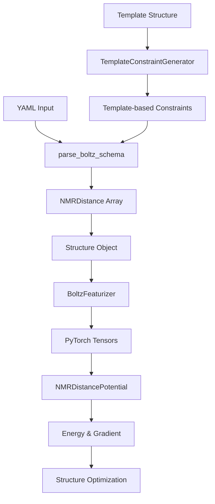
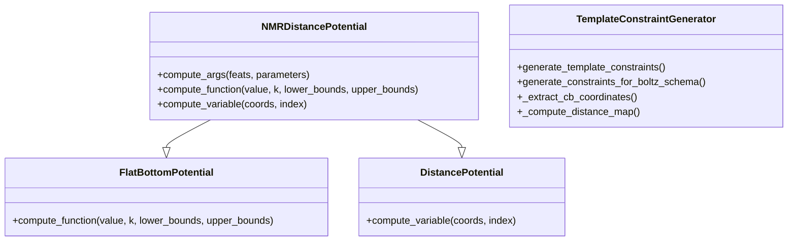

# NMR Distance Constraints Implementation

## 개요 (Overview)

NMR Distance Constraints는 기존 MinDistancePotential의 한계를 극복하기 위해 개발된 새로운 constraint 시스템입니다. NMR 실험에서 얻는 NOE(Nuclear Overhauser Effect) 데이터처럼 상한과 하한을 모두 가지는 거리 제약 조건을 지원합니다.

## 주요 특징 (Key Features)

### 1. 상한/하한 동시 적용
- **Lower Bound**: 최소 허용 거리 설정
- **Upper Bound**: 최대 허용 거리 설정
- **Flexible Bounds**: 상한만, 하한만, 또는 둘 다 설정 가능

### 2. 가중치 시스템
- **Individual Weights**: 각 constraint별 개별 가중치 설정
- **Confidence-based**: 실험 데이터의 신뢰도에 따른 차등 적용
- **Force Constant Scaling**: 가중치에 따른 force constant 조절

### 3. 기존 시스템과의 호환성
- **Parallel Usage**: MinDistancePotential과 병행 사용 가능
- **Unified Interface**: 동일한 YAML 스키마 구조 사용
- **Seamless Integration**: 기존 workflow에 자연스럽게 통합

### 4. Template-based Constraint 생성 (신규 기능)
- **Automatic Generation**: Template 구조로부터 자동 constraint 생성
- **Dual Mode Support**: min_distance와 nmr_distance 방식 모두 지원
- **Intelligent Weighting**: 시퀀스 identity와 거리 기반 가중치 자동 계산
- **Flexible Parameters**: Buffer, weight 등 세부 파라미터 조절 가능

## 구현 아키텍처 (Implementation Architecture)

### 데이터 플로우


### 클래스 구조


## 구현 세부사항 (Implementation Details)

### 1. 데이터 타입 정의 (types.py)

```python
NMRDistance = [
    ("chain_1", np.dtype("i4")),      # Chain index
    ("chain_2", np.dtype("i4")),      # Chain index  
    ("res_1", np.dtype("i4")),        # Residue index
    ("res_2", np.dtype("i4")),        # Residue index
    ("atom_1", np.dtype("i4")),       # Atom index
    ("atom_2", np.dtype("i4")),       # Atom index
    ("lower_bound", np.dtype("f4")),  # Minimum distance (Å)
    ("upper_bound", np.dtype("f4")),  # Maximum distance (Å)
    ("weight", np.dtype("f4")),       # Constraint weight
]
```

### 2. YAML 스키마 (schema.py)

```yaml
constraints:
  - nmr_distance:
      atom1: ["A", 10, "CA"]    # [chain_id, residue_number, atom_name]
      atom2: ["A", 50, "CA"]    # [chain_id, residue_number, atom_name]
      lower_bound: 8.0          # Optional, default: 0.0
      upper_bound: 12.0         # Optional, default: inf
      weight: 1.0               # Optional, default: 1.0
```

### 3. 피처화 (featurizer.py)

```python
# Generated features for NMR constraints
{
    "nmr_distance_atom_index": torch.Tensor,      # [2, N] atom pair indices
    "nmr_distance_lower_bounds": torch.Tensor,    # [N] lower bounds
    "nmr_distance_upper_bounds": torch.Tensor,    # [N] upper bounds  
    "nmr_distance_weights": torch.Tensor,         # [N] constraint weights
}
```

### 4. Potential 함수 (potentials.py)

```python
class NMRDistancePotential(FlatBottomPotential, DistancePotential):
    def compute_args(self, feats, parameters):
        # Extract constraint data
        pair_index = feats['nmr_distance_atom_index'][0]
        lower_bounds = feats['nmr_distance_lower_bounds'][0].clone()
        upper_bounds = feats['nmr_distance_upper_bounds'][0].clone()
        weights = feats['nmr_distance_weights'][0]
        
        # Apply buffers for soft constraints
        lower_bounds *= (1.0 - parameters['lower_buffer'])
        finite_mask = torch.isfinite(upper_bounds)
        upper_bounds[finite_mask] *= (1.0 + parameters['upper_buffer'])
        
        # Scale force constants by weights
        k = weights * parameters['base_force_constant']
        
        return pair_index, (k, lower_bounds, upper_bounds), None
```

## 파라미터 설정 (Parameter Configuration)

### NMRDistancePotential 파라미터

| Parameter | Default | Description |
|-----------|---------|-------------|
| `guidance_interval` | 1 | Guidance 적용 간격 (매 step) |
| `guidance_weight` | 0.20 | Guidance 강도 |
| `resampling_weight` | 5.0 | Resampling 강도 |
| `lower_buffer` | 0.05 | 하한 완화율 (5%) |
| `upper_buffer` | 0.05 | 상한 완화율 (5%) |
| `base_force_constant` | 10.0 | 기본 force constant |

### Buffer 시스템
- **Lower Buffer**: 하한을 5% 감소시켜 약간의 유연성 제공
- **Upper Buffer**: 상한을 5% 증가시켜 과도한 제약 방지
- **Infinite Handling**: 무한대 상한값에 대한 안전한 처리

## 사용법 (Usage)

### 기본 사용법

```yaml
version: 1
sequences:
  - protein:
      id: A
      sequence: "MADQLTEEQIAEFKEAFSLF"
      msa: empty

constraints:
  # 상한과 하한 모두 설정
  - nmr_distance:
      atom1: ["A", 10, "CA"]
      atom2: ["A", 50, "CA"]
      lower_bound: 8.0
      upper_bound: 12.0
      weight: 1.0
```

### 고급 사용법

```yaml
constraints:
  # 하한만 설정 (상한은 무한대)
  - nmr_distance:
      atom1: ["A", 15, "CB"]
      atom2: ["A", 45, "CB"]
      lower_bound: 5.0
      weight: 2.0
  
  # 상한만 설정 (하한은 0)
  - nmr_distance:
      atom1: ["A", 20, "CA"]
      atom2: ["A", 80, "CA"]
      upper_bound: 15.0
      weight: 0.5
  
  # 기존 min_distance와 병행 사용
  - min_distance:
      atom1: ["A", 30, "CA"]
      atom2: ["A", 70, "CA"]
      distance: 7.0
```

### Template-based Constraint 사용법 (신규 기능)

#### 1. NMR Distance Template Constraints (기본값)

```yaml
version: 1
sequences:
  - protein:
      id: A
      sequence: "MADQLTEEQIAEFKEAFSLF"
      msa: empty
      # Template 설정으로 자동 NMR constraint 생성
      template:
        structure: "/path/to/template.pdb"  # Template 구조 파일 경로
        chain_id: "A"                      # Template chain ID
        constraint_type: "nmr_distance"    # NMR constraint 생성 (기본값)
        distance_buffer: 0.1               # 거리 buffer (10%, 선택사항)
        base_weight: 1.0                   # 기본 가중치 (선택사항)
        sequence_identity_weight: true     # 시퀀스 identity 기반 가중치 (선택사항)

# 수동 constraint와 함께 사용 가능
constraints:
  - nmr_distance:
      atom1: ["A", 25, "CB"]
      atom2: ["A", 75, "CB"]
      lower_bound: 6.0
      upper_bound: 10.0
      weight: 2.0
```

#### 2. Min Distance Template Constraints (호환성)

```yaml
version: 1
sequences:
  - protein:
      id: A
      sequence: "MADQLTEEQIAEFKEAFSLF"
      msa: empty
      # 기존 min_distance 방식으로 template constraint 생성
      template:
        structure: "/path/to/template.pdb"
        chain_id: "A"
        constraint_type: "min_distance"    # 기존 방식 사용

constraints:
  - min_distance:
      atom1: ["A", 30, "CA"]
      atom2: ["A", 70, "CA"]
      distance: 7.0
```

#### 3. Template Constraint 파라미터 설명

| Parameter | Type | Default | Description |
|-----------|------|---------|-------------|
| `structure` | str | Required | Template 구조 파일 경로 (.pdb, .cif) |
| `chain_id` | str | Required | Template chain identifier |
| `constraint_type` | str | "nmr_distance" | Constraint 타입 ("nmr_distance" 또는 "min_distance") |
| `distance_buffer` | float | 0.1 | NMR bounds buffer 비율 (10%) |
| `base_weight` | float | 1.0 | NMR constraint 기본 가중치 |
| `sequence_identity_weight` | bool | true | 시퀀스 identity 기반 가중치 스케일링 |

#### 4. Template Constraint 생성 로직

**NMR Distance Mode:**
- **Lower Bound**: `template_distance × (1 - distance_buffer)`
- **Upper Bound**: `template_distance × (1 + distance_buffer)`
- **Weight**: `base_weight × seq_identity × distance_factor`
  - `distance_factor`: 가까운 거리일수록 높은 가중치
  - `seq_identity`: 시퀀스 유사도가 높을수록 높은 가중치

**Min Distance Mode:**
- **Distance**: `template_distance` (기존 방식과 동일)

#### 5. 프로그래밍 방식 사용법

```python
from boltz.data.parse.template import TemplateConstraintGenerator, apply_template_constraints

# 1. 직접 constraint 생성
generator = TemplateConstraintGenerator()
constraints = generator.generate_template_constraints(
    query_sequence="MADQLTEEQIAEFKEAFSLF",
    template_structure="/path/to/template.pdb",
    template_chain_id="A",
    query_chain_id="A",
    constraint_type="nmr_distance",  # 또는 "min_distance"
    distance_buffer=0.15,            # 15% buffer
    base_weight=1.5,                 # 높은 가중치
    sequence_identity_weight=True
)

# 2. Schema에 직접 적용
schema_data = {
    "version": 1,
    "sequences": [{"protein": {"id": "A", "sequence": "...", "msa": "empty"}}]
}

updated_schema = apply_template_constraints(
    schema_data=schema_data,
    template_structure="/path/to/template.pdb",
    template_chain_id="A",
    target_chain_id="A",
    constraint_type="nmr_distance",
    distance_buffer=0.1,
    base_weight=1.0
)
```

## 검증 및 에러 처리 (Validation & Error Handling)

### 입력 검증
1. **Required Fields**: atom1, atom2 필수 확인
2. **Bound Validation**: lower_bound ≥ 0, upper_bound > lower_bound
3. **Weight Validation**: weight > 0
4. **Atom Mapping**: 유효한 원자 인덱스 확인

### 에러 메시지
```python
# 잘못된 bound 설정
"Lower bound must be non-negative, got {lower_bound}"
"Upper bound ({upper_bound}) must be greater than lower bound ({lower_bound})"

# 필수 필드 누락
"NMR distance constraint was not properly specified"
```

## 성능 특성 (Performance Characteristics)

### 계산 복잡도
- **Memory**: O(N) where N = number of constraints
- **Computation**: O(N) distance calculations per step
- **Gradient**: O(N) gradient computations

### 최적화 특성
- **Convergence**: 일반적으로 5-10 step 내 수렴
- **Stability**: Buffer 시스템으로 안정적 최적화
- **Scalability**: 수백 개의 constraint까지 효율적 처리

## 기존 시스템과의 비교 (Comparison with Existing Systems)

| Feature | MinDistancePotential | NMRDistancePotential |
|---------|---------------------|---------------------|
| Lower Bound | ✅ | ✅ |
| Upper Bound | ❌ | ✅ |
| Individual Weights | ❌ | ✅ |
| Buffer System | ❌ | ✅ |
| NMR Data Support | ❌ | ✅ |
| Backward Compatibility | ✅ | ✅ |

## 제한사항 (Limitations)

1. **Constraint Conflicts**: 상충하는 constraint 자동 해결 없음
2. **Dynamic Weights**: 시간에 따른 가중치 변화 미지원
3. **Cross-chain Validation**: 체인 간 constraint 검증 제한적
4. **Memory Usage**: 대량 constraint 시 메모리 사용량 증가

## 향후 개선 방향 (Future Improvements)

1. **Adaptive Weights**: 수렴 상태에 따른 동적 가중치 조절
2. **Constraint Clustering**: 유사한 constraint 그룹화 및 최적화
3. **Validation Tools**: Constraint 충돌 검출 및 해결 도구
4. **Performance Optimization**: GPU 병렬화 및 메모리 최적화

## 예제 및 테스트 (Examples & Testing)

### 테스트 파일
- `examples/test_nmr_constraints.yaml`: 기본 사용법 예제
- 다양한 constraint 조합 테스트
- 기존 시스템과의 호환성 검증

### 검증 방법
1. **Unit Tests**: 각 구성 요소별 단위 테스트
2. **Integration Tests**: 전체 workflow 통합 테스트  
3. **Performance Tests**: 대량 constraint 성능 테스트
4. **Compatibility Tests**: 기존 기능과의 호환성 테스트

## 결론 (Conclusion)

NMRDistancePotential은 기존 MinDistancePotential의 한계를 극복하고 NMR 실험 데이터를 효과적으로 활용할 수 있는 강력한 constraint 시스템입니다. 

### 주요 개선사항:

1. **상한/하한 동시 적용**: 기존 하한만 지원하던 것에서 상한과 하한을 모두 지원하여 더 정확한 거리 제약 가능
2. **가중치 시스템**: 각 constraint별 개별 가중치 설정으로 실험 데이터의 신뢰도 반영
3. **Template-based 자동 생성**: Template 구조로부터 자동으로 constraint 생성하여 사용자 편의성 대폭 향상
4. **지능형 가중치 계산**: 시퀀스 identity와 거리 기반 자동 가중치 계산으로 최적화된 constraint 적용
5. **완벽한 호환성**: 기존 MinDistancePotential과 병행 사용 가능하며 기존 workflow 유지

### 새로운 Template 기능의 장점:

- **자동화**: 수동으로 constraint를 설정할 필요 없이 template 구조만 제공하면 자동 생성
- **유연성**: NMR distance와 min distance 두 방식 모두 지원
- **정확성**: 시퀀스 alignment와 거리 정보를 종합하여 신뢰도 높은 constraint 생성
- **확장성**: 다양한 파라미터 조절로 다양한 실험 조건에 맞춤 설정 가능

### 사용 시나리오:

1. **NMR 실험 데이터 활용**: NOE 데이터를 직접 constraint로 변환
2. **Template 기반 예측**: 유사한 구조의 template을 활용한 자동 constraint 생성
3. **하이브리드 접근**: 실험 데이터와 template 정보를 조합한 종합적 constraint 적용
4. **기존 시스템 호환**: 기존 min_distance 기반 workflow와의 완벽한 호환성 유지

이러한 개선을 통해 더 정확하고 물리적으로 타당한 단백질 구조 예측이 가능하며, 사용자의 다양한 요구사항을 효과적으로 지원할 수 있습니다. 