# Boltz Input Processing

이 문서는 `boltz` 프로젝트의 입력 데이터 처리 과정, 특히 `process_inputs` 함수의 동작을 상세히 설명합니다.

## process_inputs 함수 개요

`process_inputs` 함수는 `src/boltz/main.py`에 위치하며, 다양한 입력 파일(FASTA, YAML)을 파싱하고 처리하여 `boltz` 모델이 사용할 수 있는 형식으로 변환하는 역할을 담당합니다. 이 과정에서 MSA(Multiple Sequence Alignment) 데이터 생성, 구조체 처리, 제약 조건 설정 등의 작업이 수행됩니다.

## 입력 처리 흐름도

아래 mermaid 플로우차트는 `process_inputs` 함수의 동작 흐름을 시각화합니다:

```mermaid
flowchart TD
    A[boltz predict 명령어 실행] --> B[check_inputs 함수<br/>입력 파일 유효성 검사]
    B --> C[process_inputs 함수 호출]
    C --> D{기존 manifest.json<br/>존재 여부 확인}
    
    D -->|존재| E[기존 Manifest 로드<br/>Manifest.load]
    D -->|미존재| F[새 records 리스트 초기화]
    
    E --> G[기존 Record들과 비교<br/>누락된 파일 확인]
    G --> H{처리할 파일<br/>있는가?}
    H -->|없음| I[기존 Manifest 업데이트 후 저장]
    H -->|있음| J[누락된 파일들만 처리]
    
    F --> K[각 입력 파일 순회<br/>for path in data]
    J --> K
    
    K --> L{파일 형식 확인}
    L -->|.fasta/.fa/.fas| M[parse_fasta 호출]
    L -->|.yaml/.yml| N[parse_yaml 호출]
    L -->|기타| O[에러 발생]
    
    M --> P[Target 객체 생성<br/>record, structure, constraints 포함]
    N --> P
    
    P --> Q[MSA 생성 필요 여부 확인<br/>단백질 체인의 msa_id == 0]
    Q -->|필요| R[compute_msa 함수 호출<br/>MMSeqs2 서버 사용]
    Q -->|불필요| S[MSA 파일 처리]
    
    R --> S
    S --> T[MSA 데이터 파싱 및 저장<br/>.a3m 또는 .csv 형식]
    T --> U[Record 객체에 MSA 경로 업데이트]
    U --> V[Structure 데이터 저장<br/>.npz 형식]
    V --> W[Constraints 데이터 저장<br/>.npz 형식]
    W --> X[records 리스트에 추가]
    
    X --> Y{모든 파일<br/>처리 완료?}
    Y -->|아니오| K
    Y -->|예| Z[Manifest 객체 생성<br/>Manifest&#40;records&#41;]
    
    Z --> AA[manifest.json 파일 저장<br/>manifest.dump&#40;&#41;]
    
    I --> BB[process_inputs 함수 종료]
    AA --> BB

    %% 서브그래프로 그룹화
    subgraph "입력 검증 및 초기화"
        A
        B
        C
        D
        E
        F
        G
        H
        I
        J
    end
    
    subgraph "개별 파일 처리 루프"
        K
        L
        M
        N
        O
        P
        Q
        R
        S
        T
        U
        V
        W
        X
        Y
    end
    
    subgraph "Manifest 생성 및 저장"
        Z
        AA
        BB
    end

    %% 스타일링
    classDef input fill:#e3f2fd,stroke:#0277bd,stroke-width:2px
    classDef process fill:#f3e5f5,stroke:#4a148c,stroke-width:2px
    classDef output fill:#e8f5e8,stroke:#1b5e20,stroke-width:2px
    classDef error fill:#ffebee,stroke:#c62828,stroke-width:2px
    
    class A,B input
    class C,E,F,G,J,K,M,N,P,Q,R,S,T,U,V,W,X,Z process
    class I,AA,BB output
    class O error
```



## process_inputs 함수 상세 분석

### 1. 기존 Manifest 처리

```python
# Check if manifest exists at output path
manifest_path = out_dir / "processed" / "manifest.json"
if manifest_path.exists():
    click.echo(f"Found a manifest file at output directory: {out_dir}")

    manifest: Manifest = Manifest.load(manifest_path)
    input_ids = [d.stem for d in data]
    existing_records = [
        record for record in manifest.records if record.id in input_ids
    ]
    processed_ids = [record.id for record in existing_records]

    # Check how many examples need to be processed
    missing = len(input_ids) - len(processed_ids)
    if not missing:
        click.echo("All examples in data are processed. Updating the manifest")
        # Dump updated manifest
        updated_manifest = Manifest(existing_records)
        updated_manifest.dump(out_dir / "processed" / "manifest.json")
        return

    click.echo(f"{missing} missing ids. Preprocessing these ids")
    missing_ids = list(set(input_ids).difference(set(processed_ids)))
    data = [d for d in data if d.stem in missing_ids]
    assert len(data) == len(missing_ids)
```

이 부분은 기존에 처리된 데이터가 있는지 확인하고, 이미 처리된 파일은 건너뛰는 증분 처리 로직입니다. 이를 통해 데이터 처리의 효율성을 높일 수 있습니다.

### 2. 디렉토리 구조 생성

```python
# Create output directories
msa_dir = out_dir / "msa"
structure_dir = out_dir / "processed" / "structures"
processed_msa_dir = out_dir / "processed" / "msa"
processed_constraints_dir = out_dir / "processed" / "constraints"
predictions_dir = out_dir / "predictions"

out_dir.mkdir(parents=True, exist_ok=True)
msa_dir.mkdir(parents=True, exist_ok=True)
structure_dir.mkdir(parents=True, exist_ok=True)
processed_msa_dir.mkdir(parents=True, exist_ok=True)
processed_constraints_dir.mkdir(parents=True, exist_ok=True)
predictions_dir.mkdir(parents=True, exist_ok=True)
```

처리된 데이터를 저장할 디렉토리 구조를 생성합니다. 각 데이터 유형별로 개별 디렉토리가 있습니다.

### 3. 개별 파일 처리

```python
# Parse input data
records: list[Record] = existing_records if existing_records is not None else []
for path in tqdm(data):
    try:
        # Parse data
        if path.suffix in (".fa", ".fas", ".fasta"):
            target = parse_fasta(path, ccd)
        elif path.suffix in (".yml", ".yaml"):
            target = parse_yaml(path, ccd)
        elif path.is_dir():
            msg = f"Found directory {path} instead of .fasta or .yaml, skipping."
            raise RuntimeError(msg)
        else:
            msg = (
                f"Unable to parse filetype {path.suffix}, "
                "please provide a .fasta or .yaml file."
            )
            raise RuntimeError(msg)

        # Get target id
        target_id = target.record.id
        
        # Process MSA, Structure, Constraints...
```

각 입력 파일에 대해:

1. FASTA 또는 YAML 형식에 따라 적절한 파서를 호출합니다.
2. 파싱된 데이터로부터 Target 객체를 생성합니다.
3. MSA 데이터를 생성하고 처리합니다.
4. 구조체와 제약 조건 데이터를 처리하고 저장합니다.

### 4. MSA 처리

```python
# Get all MSA ids and decide whether to generate MSA
to_generate = {}
prot_id = const.chain_type_ids["PROTEIN"]
for chain in target.record.chains:
    # Add to generate list, assigning entity id
    if (chain.mol_type == prot_id) and (chain.msa_id == 0):
        entity_id = chain.entity_id
        msa_id = f"{target_id}_{entity_id}"
        to_generate[msa_id] = target.sequences[entity_id]
        chain.msa_id = msa_dir / f"{msa_id}.csv"

# Generate MSA
if to_generate and not use_msa_server:
    msg = "Missing MSA's in input and --use_msa_server flag not set."
    raise RuntimeError(msg)

if to_generate:
    compute_msa(
        data=to_generate,
        target_id=target_id,
        msa_dir=msa_dir,
        msa_server_url=msa_server_url,
        msa_pairing_strategy=msa_pairing_strategy,
    )

# Parse MSA data
msas = sorted({c.msa_id for c in target.record.chains if c.msa_id != -1})
```

MSA(Multiple Sequence Alignment) 데이터 처리는 단백질 구조 예측에 중요합니다:

1. MSA가 필요한 단백질 체인을 식별합니다.
2. MSA 서버를 사용하여 필요한 MSA를 생성합니다.
3. 생성된 MSA를 파싱하고 처리합니다.

### 5. 최종 데이터 저장

```python
# Modify records to point to processed MSA
for c in target.record.chains:
    if (c.msa_id != -1) and (c.msa_id in msa_id_map):
        c.msa_id = msa_id_map[c.msa_id]

# Keep record
records.append(target.record)

# Dump structure
struct_path = structure_dir / f"{target.record.id}.npz"
target.structure.dump(struct_path)

# Dump constraints
constraints_path = processed_constraints_dir / f"{target.record.id}.npz"
target.residue_constraints.dump(constraints_path)
```

처리된 모든 데이터는 다음과 같이 저장됩니다:

1. MSA 데이터는 NPZ 형식으로 저장됩니다.
2. 구조체 데이터는 NPZ 형식으로 저장됩니다.
3. 제약 조건 데이터는 NPZ 형식으로 저장됩니다.
4. Record 객체는 records 리스트에 추가됩니다.

### 6. Manifest 생성 및 저장

```python
# Dump manifest
manifest = Manifest(records)
manifest.dump(out_dir / "processed" / "manifest.json")
```

모든 처리가 완료된 후, 최종 Manifest 객체가 생성되고 JSON 파일로 저장됩니다. 이 파일은 모든 처리된 데이터에 대한 메타데이터를 포함하며, 후속 단계에서 참조됩니다.

## 입력 처리 결과물

처리 과정 후, 다음과 같은 출력 디렉토리 구조가 생성됩니다:

```
out_dir/
├── msa/                             # 원본 MSA 파일
├── processed/
│   ├── manifest.json                # 처리된 데이터 매니페스트
│   ├── structures/                  # 처리된 구조 데이터 (.npz)
│   ├── msa/                         # 처리된 MSA 데이터 (.npz)
│   └── constraints/                 # 처리된 제약 조건 데이터 (.npz)
└── predictions/                     # 추후 모델 예측 결과
```

## Record 객체 구조

Manifest에 저장되는 핵심 객체인 Record는 다음 구조를 가집니다:

```python
@dataclass(frozen=True)
class Record(JSONSerializable):
    id: str                              # 고유 식별자
    structure: StructureInfo             # 구조 메타데이터
    chains: list[ChainInfo]              # 체인 정보 리스트
    interfaces: list[InterfaceInfo]      # 인터페이스 정보 리스트
    inference_options: Optional[InferenceOptions] = None  # 추론 옵션
```

각 Chain은 다음과 같은 정보를 포함합니다:

```python
@dataclass(frozen=True)
class ChainInfo:
    chain_id: int                        # 체인 ID
    chain_name: str                      # 체인 이름
    mol_type: int                        # 분자 타입 (단백질/DNA/RNA/리간드)
    cluster_id: Union[str, int]          # 클러스터 ID
    msa_id: Union[str, int]              # MSA 파일 경로 또는 ID
    num_residues: int                    # 잔기 수
    valid: bool = True                   # 유효성 플래그
    entity_id: Optional[Union[str, int]] = None  # 엔티티 ID
```

## 추가 분석 및 탐색 방향

### 입력 파일 형식 분석 (FASTA/YAML)

`boltz`는 두 가지 주요 입력 형식을 지원합니다:

1. **FASTA 형식**: 간단하고 표준적인 형식으로, 각 체인의 시퀀스를 제공합니다.
2. **YAML 형식**: 더 복잡한 입력을 지원하며, 공유결합, 수정된 잔기 등을 지정할 수 있습니다.

FASTA 파일에서 각 항목은 다음과 같은 형식을 가집니다:
```
>CHAIN_ID|ENTITY_TYPE|MSA_PATH
SEQUENCE
```

YAML 파일에서는 다음과 같은 더 복잡한 구조를 지원합니다:
```yaml
sequences:
    - ENTITY_TYPE:
        id: CHAIN_ID 
        sequence: SEQUENCE
        # 기타 속성...
constraints:
    - bond:
        atom1: [CHAIN_ID, RES_IDX, ATOM_NAME]
        atom2: [CHAIN_ID, RES_IDX, ATOM_NAME]
    # 기타 제약조건...
```

### 향후 코드 분석 방향

이러한 입력 처리 과정에 대한 더 깊은 이해를 위해 다음과 같은 방향으로 분석을 진행해 볼 수 있습니다:

#### 1. 파서 구현 분석

`parse_fasta`와 `parse_yaml` 함수의 구현을 살펴보면 입력 데이터가 어떻게 파싱되고 검증되는지 이해할 수 있습니다. 다음 파일들을 분석하는 것이 유용할 것입니다:

```
src/boltz/data/parse/fasta.py
src/boltz/data/parse/yaml.py
```

#### 2. MSA 생성 및 처리 분석

MSA 데이터는 단백질 구조 예측에 중요한 요소입니다. `compute_msa` 함수의 구현과 MSA 처리 관련 코드를 살펴보면 MSA가 어떻게 생성되고 처리되는지 이해할 수 있습니다:

```
src/boltz/data/msa/mmseqs2.py
src/boltz/data/parse/a3m.py
src/boltz/data/parse/csv.py
```

#### 3. Manifest 클래스 구조 분석

Manifest 클래스는 처리된 데이터의 메타데이터를 관리합니다. 이 클래스의 구현을 살펴보면 데이터가 어떻게 저장되고 로드되는지 이해할 수 있습니다:

```
src/boltz/data/types.py
```

#### 4. 함수 간 데이터 흐름 추적

`predict` 함수에서 시작하여 `process_inputs` 함수를 호출하고, 그 결과가 `BoltzInferenceDataModule`에 어떻게 전달되는지 추적하면 전체 데이터 파이프라인을 이해하는 데 도움이 됩니다:

```
src/boltz/main.py
src/boltz/data/module/inference.py
```

#### 5. 테스트 데이터로 실험

간단한 입력 파일(FASTA 또는 YAML)로 실험하고 처리 과정을 단계별로 추적하면 실제 동작 방식을 더 잘 이해할 수 있습니다:

```bash
boltz predict examples/msa/simple_protein.fasta --use_msa_server
```

#### 추천되는 분석 방법론: Code tracing

1. 디버거를 사용하여 `process_inputs` 함수의 실행 흐름을 추적합니다.
2. 중요 변수와 객체의 상태 변화를 관찰합니다.
3. 함수 호출 스택을 추적하여 함수 간의 관계를 이해합니다.
4. 처리 전/후의 파일 구조와 내용을 비교하여 변환 과정을 이해합니다.

```python
# Code tracing example using debugger
import pdb

# Set breakpoint at the beginning of process_inputs function
pdb.set_trace()

# Run the command
# boltz predict examples/msa/simple_protein.fasta --use_msa_server
```

위와 같은 분석을 통해 `boltz`의 입력 처리 파이프라인의 복잡한 동작을 더 깊이 이해할 수 있을 것입니다. 