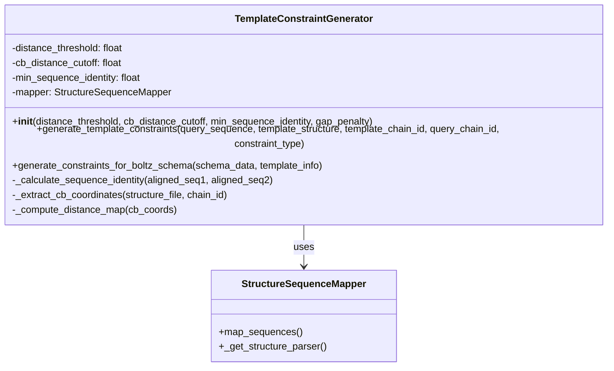
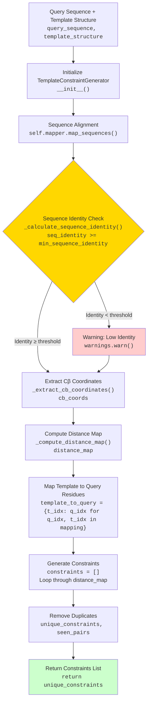
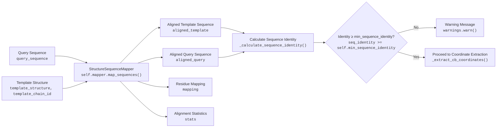
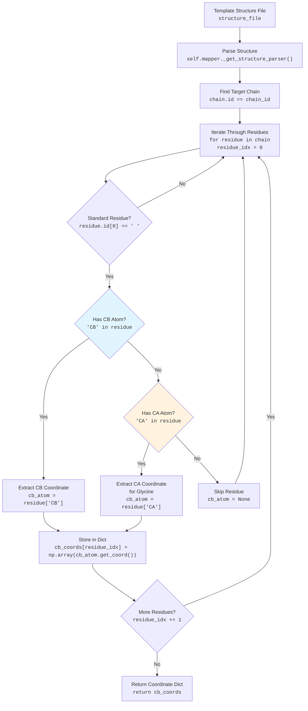
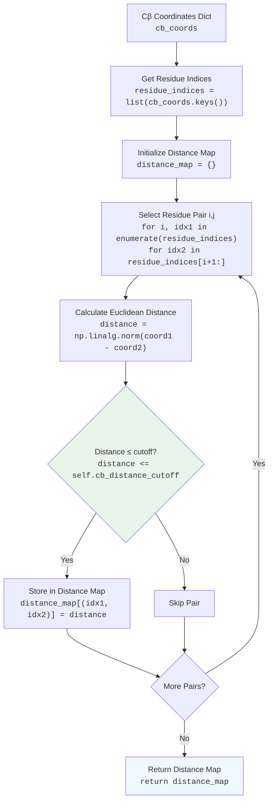
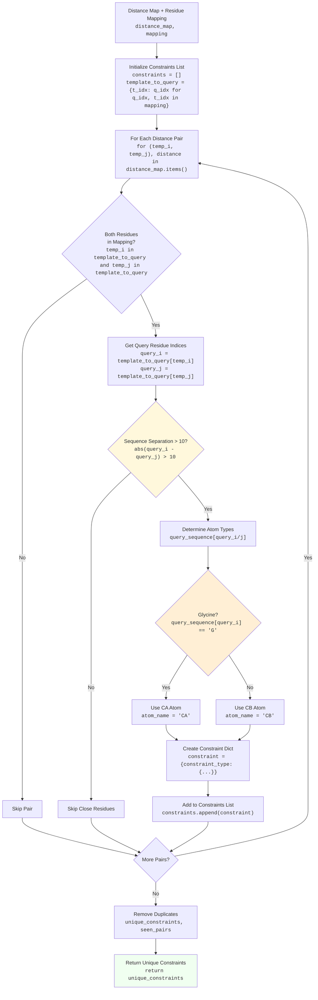
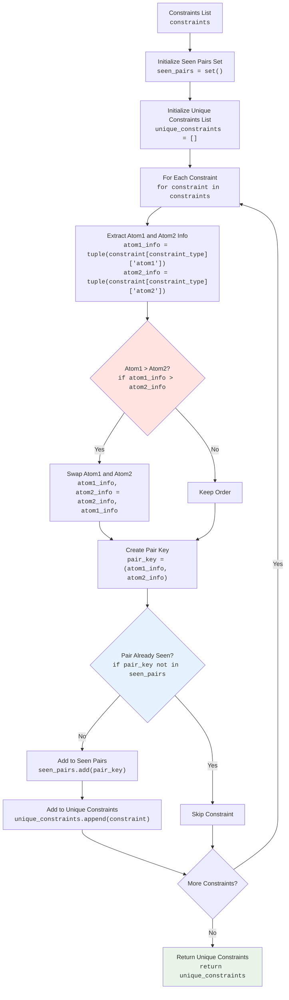

# Template-based Distance Constraint Generator Documentation

## 개요 (Overview)

`TemplateConstraintGenerator`는 단백질 구조 예측을 위한 템플릿 기반 거리 제약 조건 생성기입니다. 이 클래스는 기지의 단백질 구조(템플릿)를 사용하여 새로운 단백질 구조 예측 시 물리적으로 불가능한 형태를 방지하기 위한 거리 제약 조건을 생성합니다.

## 주요 기능 (Key Features)

- **템플릿 기반 제약 조건 생성**: 기존 단백질 구조를 템플릿으로 사용하여 거리 제약 조건 생성
- **서열 정렬 기반 매핑**: 쿼리 서열과 템플릿 구조 간의 정렬을 통한 정확한 잔기 매핑
- **Cβ-Cβ 거리 계산**: Cβ 원자 간 거리를 기반으로 한 거리 맵 생성
- **Boltz 스키마 호환**: Boltz 모델의 입력 스키마에 호환되는 제약 조건 형식

## 클래스 구조 (Class Architecture)



## 전체 워크플로우 (Complete Workflow)



## 세부 프로세스 분석 (Detailed Process Analysis)

### 1. 서열 정렬 및 매핑 (Sequence Alignment & Mapping)



### 2. Cβ 좌표 추출 (Cβ Coordinate Extraction)



### 3. 거리 맵 계산 (Distance Map Computation)



### 4. 제약 조건 생성 (Constraint Generation)



### 5. 중복 제거 알고리즘 (Deduplication Algorithm)



## 매개변수 설정 (Parameter Configuration)

| Parameter | Default Value | Description |
|-----------|---------------|-------------|
| `distance_threshold` | 35.0 Å | 제약 조건 고려를 위한 최대 거리 |
| `cb_distance_cutoff` | 20.0 Å | Cβ-Cβ 거리 제약 조건 생성을 위한 최대 거리 |
| `min_sequence_identity` | 0.6 | 신뢰할 수 있는 정렬을 위한 최소 서열 동일성 |
| `gap_penalty` | -2.0 | 서열 정렬을 위한 갭 페널티 |

## 제약 조건 스키마 (Constraint Schema)

생성되는 제약 조건은 다음과 같은 Boltz 호환 형식을 가집니다:

```json
{
  "min_distance": {
    "atom1": ["A", 15, "CB"],
    "atom2": ["A", 42, "CB"],
    "distance": 8.547
  }
}
```

### 스키마 구성 요소:
- **atom1/atom2**: `[chain_id, residue_number, atom_name]`
- **chain_id**: 체인 식별자 (예: "A")
- **residue_number**: 1-기반 잔기 번호
- **atom_name**: 원자 이름 ("CB" 또는 글라이신의 경우 "CA")
- **distance**: 원자 간 거리 (Ångström, 소수점 3자리)

## 사용 예제 (Usage Examples)

### 기본 사용법

```python
from boltz.data.parse.template import TemplateConstraintGenerator

# 제약 조건 생성기 초기화
generator = TemplateConstraintGenerator(
    distance_threshold=35.0,
    cb_distance_cutoff=20.0,
    min_sequence_identity=0.6
)

# 템플릿 기반 제약 조건 생성
constraints = generator.generate_template_constraints(
    query_sequence="MKVLFVAS...",
    template_structure="template.pdb",
    template_chain_id="A",
    query_chain_id="A"
)
```

### Boltz 스키마와 통합

```python
from boltz.data.parse.template import apply_template_constraints

# 기존 스키마 데이터에 템플릿 제약 조건 추가
modified_schema = apply_template_constraints(
    schema_data=original_schema,
    template_structure="template.pdb",
    template_chain_id="A",
    target_chain_id="A"
)
```

## 에러 처리 및 경고 (Error Handling & Warnings)

시스템은 다음과 같은 상황에서 경고 또는 에러를 발생시킵니다:

1. **낮은 서열 동일성**: 설정된 임계값보다 낮은 서열 동일성
2. **좌표 추출 실패**: 템플릿 구조에서 Cβ 좌표 추출 실패
3. **체인 누락**: 지정된 체인 ID를 찾을 수 없음
4. **구조 파싱 에러**: PDB/mmCIF 파일 파싱 실패

## 성능 고려사항 (Performance Considerations)

- **메모리 사용량**: 큰 단백질의 경우 거리 맵이 O(n²) 메모리를 사용
- **계산 복잡도**: 거리 계산은 O(n²) 시간 복잡도
- **중복 제거**: 제약 조건 수에 비례하는 추가 처리 시간

## 제한사항 (Limitations)

1. **서열 길이**: 매우 긴 단백질에서는 메모리 사용량이 증가
2. **템플릿 품질**: 낮은 품질의 템플릿 구조는 부정확한 제약 조건 생성
3. **서열 동일성**: 낮은 서열 동일성에서는 제약 조건의 신뢰성 감소
4. **원자 타입**: 현재 Cβ/Cα 원자만 지원 