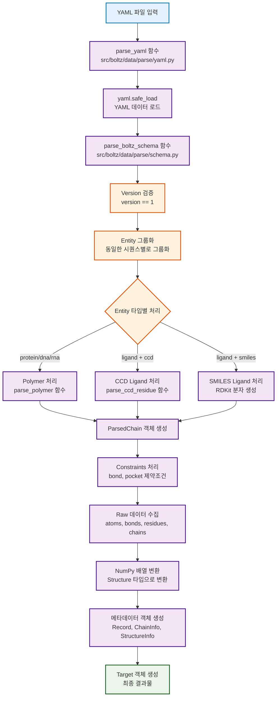
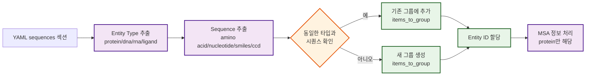
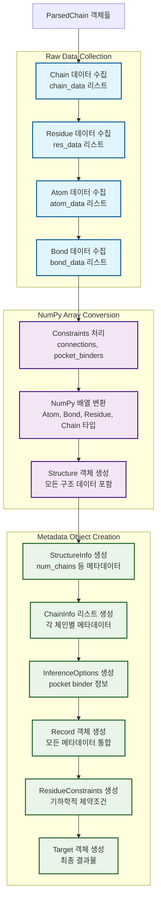
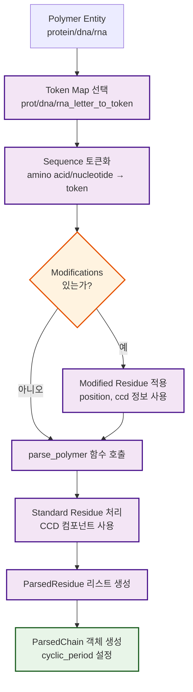
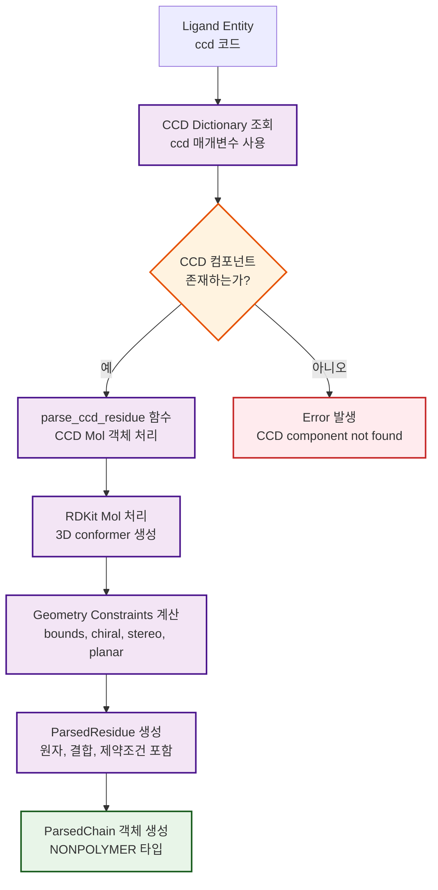
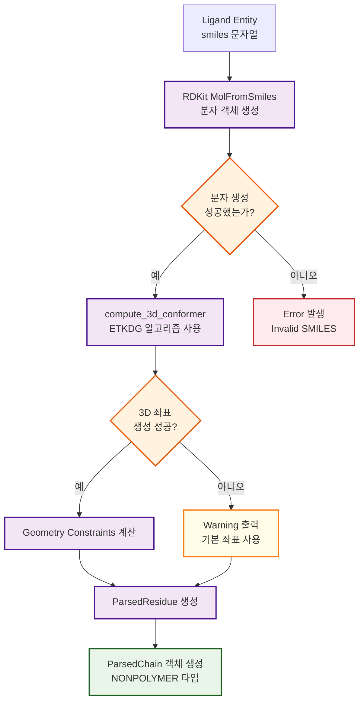
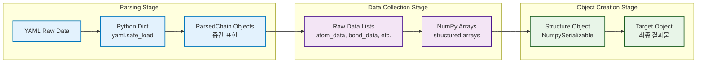

# Boltz YAML Parsing Analysis

이 문서는 `boltz` 프로젝트에서 YAML 입력 파일이 어떻게 파싱되고 메타데이터 객체들이 생성되는지를 상세히 분석합니다. 특히 Target, Record, StructureInfo, ChainInfo 등 핵심 메타데이터 객체의 생성 과정에 초점을 맞춥니다.

## YAML 파싱 전체 플로우



## 주요 단계별 상세 분석

### 1. YAML 스키마 구조 이해

YAML 입력 파일은 다음과 같은 구조를 가집니다:

```yaml
version: 1
sequences:
    - protein:
        id: A
        sequence: "MADQLTEEQIAEFKEAFSLF"
        msa: path/to/msa1.a3m
        modifications:
          - position: 5
            ccd: MSE
        cyclic: false
    - ligand:
        id: B
        smiles: "CC1=CC=CC=C1"
    - ligand:
        id: C
        ccd: ATP
constraints:
    - bond:
        atom1: [A, 1, CA]
        atom2: [A, 2, N]
    - pocket:
        binder: B
        contacts: [[A, 1], [A, 2]]
```

### 2. Entity 그룹화 과정



### 3. 메타데이터 객체 생성 과정



## 핵심 객체 구조 분석

### Target 객체 구조

Target 객체는 YAML 파싱의 최종 결과물로, 다음과 같은 구조를 가집니다:

```python
@dataclass(frozen=True)
class Target:
    """Target datatype."""
    
    record: Record                                    # 메타데이터 정보
    structure: Structure                              # 구조 데이터 (atoms, bonds, etc.)
    sequences: Optional[dict[str, str]] = None        # Entity별 시퀀스 정보
    residue_constraints: Optional[ResidueConstraints] = None  # 기하학적 제약조건
```

### Record 객체 구조

Record 객체는 처리된 데이터의 핵심 메타데이터를 포함합니다:

```python
@dataclass(frozen=True)
class Record(JSONSerializable):
    """Record datatype."""
    
    id: str                                          # 파일명에서 추출된 고유 ID
    structure: StructureInfo                         # 구조 메타데이터
    chains: list[ChainInfo]                          # 체인별 상세 정보
    interfaces: list[InterfaceInfo]                  # 인터페이스 정보 (YAML에서는 빈 리스트)
    inference_options: Optional[InferenceOptions] = None  # 추론 옵션 (pocket 정보)
```

### ChainInfo 객체 구조

각 체인의 상세 정보를 담고 있습니다:

```python
@dataclass(frozen=True)
class ChainInfo:
    """ChainInfo datatype."""
    
    chain_id: int                                    # 0부터 시작하는 체인 인덱스 (asym_id)
    chain_name: str                                  # YAML에서 지정한 체인 이름 (A, B, C, ...)
    mol_type: int                                    # 분자 타입 (protein=1, dna=2, rna=3, ligand=5)
    cluster_id: Union[str, int]                      # 클러스터 ID (-1로 초기화)
    msa_id: Union[str, int]                          # MSA 파일 경로 또는 ID
    num_residues: int                                # 잔기 수
    valid: bool = True                               # 유효성 플래그
    entity_id: Optional[Union[str, int]] = None      # 엔티티 ID
```

### Structure 객체 구조

실제 원자 및 결합 정보를 담고 있는 NumPy 배열들:

```python
@dataclass(frozen=True)
class Structure(NumpySerializable):
    """Structure datatype."""
    
    atoms: np.ndarray                                # Atom 타입의 배열
    bonds: np.ndarray                                # Bond 타입의 배열
    residues: np.ndarray                             # Residue 타입의 배열
    chains: np.ndarray                               # Chain 타입의 배열
    connections: np.ndarray                          # Connection 타입의 배열 (YAML constraints)
    interfaces: np.ndarray                           # Interface 타입의 배열 (빈 배열)
    mask: np.ndarray                                 # 체인 마스크 배열
```

## Entity별 특수 처리 과정

### Protein/DNA/RNA 처리



### Ligand 처리 (CCD)



### Ligand 처리 (SMILES)



## Constraints 처리

### Bond Constraints

YAML의 `constraints` 섹션에서 정의된 공유결합을 처리합니다:

```yaml
constraints:
    - bond:
        atom1: [A, 1, CA]  # [chain_name, residue_index, atom_name]
        atom2: [A, 2, N]
```

이는 다음과 같이 처리됩니다:

1. **Atom Index Mapping**: `(chain_name, residue_idx, atom_name)` → `(asym_id, res_idx, atom_idx)`
2. **Connection 배열 생성**: `(chain1, chain2, res1, res2, atom1, atom2)` 형태의 튜플
3. **NumPy 배열 변환**: `Connection` 타입의 배열로 변환

### Pocket Constraints

Ligand binding pocket 정보를 처리합니다:

```yaml
constraints:
    - pocket:
        binder: B           # 결합하는 체인 (ligand)
        contacts: [[A, 1], [A, 2]]  # 접촉하는 잔기들
```

이는 `InferenceOptions` 객체로 변환되어 나중에 모델 추론 시 사용됩니다.

## 데이터 변환 플로우



## 코드 분석 결과 요약

### 주요 발견사항

1. **Modular Architecture**: YAML 파싱은 여러 단계의 중간 객체(`ParsedChain`, `ParsedResidue`, `ParsedAtom`)를 거쳐 최종 `Target` 객체로 변환됩니다.

2. **Entity Grouping**: 동일한 시퀀스를 가진 체인들은 하나의 entity로 그룹화되어 처리되며, 이는 메모리 효율성을 높입니다.

3. **Constraint Processing**: YAML에서 정의된 제약조건들은 별도로 처리되어 `ResidueConstraints`와 `InferenceOptions`로 분리됩니다.

4. **RDKit Integration**: 리간드 처리에는 RDKit이 광범위하게 사용되며, 3D 좌표 생성과 기하학적 제약조건 계산이 자동으로 수행됩니다.

### 코드 구조의 장점

- **Type Safety**: 강타입 시스템과 dataclass를 사용하여 데이터 무결성을 보장합니다.
- **Serialization Support**: `NumpySerializable`과 `JSONSerializable` 믹스인을 통해 데이터 저장/로딩이 용이합니다.
- **Extensibility**: 새로운 entity 타입이나 제약조건을 쉽게 추가할 수 있는 구조입니다.

### 분석 방향 제안

추가적인 코드 분석을 위해서는 다음 방향을 고려할 수 있습니다:

1. **Performance Profiling**: 큰 분자 복합체에 대한 파싱 성능 분석
2. **Error Handling**: 다양한 잘못된 입력에 대한 에러 처리 메커니즘 분석
3. **Memory Usage**: 대규모 시스템에서의 메모리 사용 패턴 분석
4. **Validation**: 입력 데이터 검증 로직의 완전성 확인

이러한 분석을 통해 `boltz`의 YAML 파싱 시스템에 대한 포괄적인 이해를 얻을 수 있습니다. 